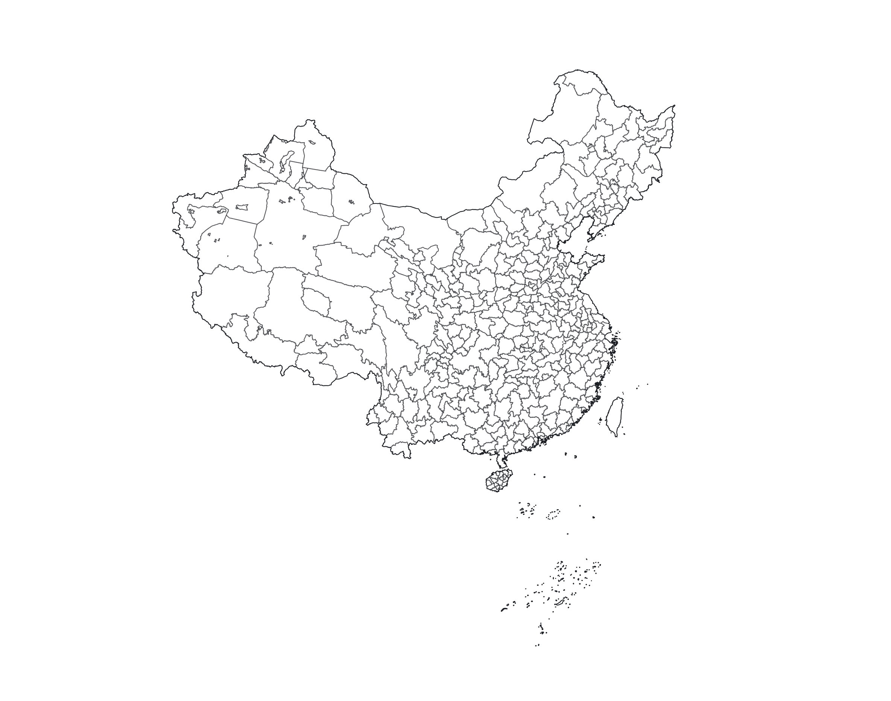
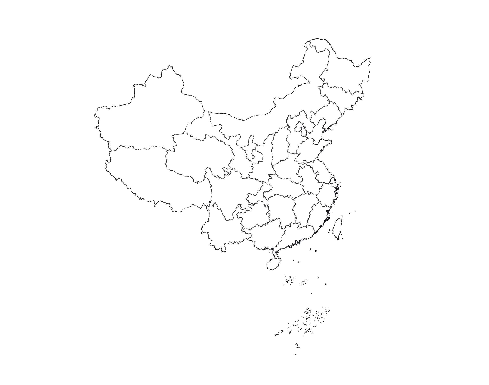
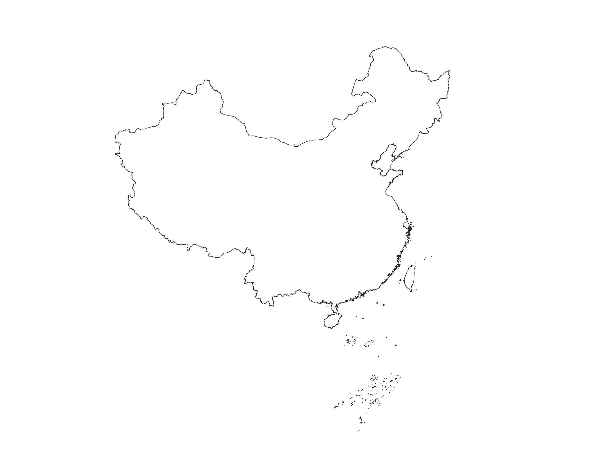

# China Atlas GeoJSON/TopoJSON

This repository provides a convenient redistribution of China's cartographic boundary shapfiles that derived from the [ruiduobao/shengshixian.com](https://github.com/ruiduobao/shengshixian.com), 2023 edition as TopoJSON and GeoJSON.

## cn-atlas.json

[Download](https://unpkg.com/cn-atlas/cn-atlas.json)

A [TopoJSON file](https://github.com/topojson/topojson-specification/blob/master/README.md#21-topology-objects) containing the geometry collection `prefetures`, `provinces`, `nation`. The geometry is quantized and simplified, but not projected. 

## prefectures.json

[Download](https://unpkg.com/cn-atlas/prefectures.json)

A [GeoJSON file](https://geojson.org) containing the geometry object `prefetures`. The geometry is quantized and simplified, but not projected.

## provinces.json

[Download](https://unpkg.com/cn-atlas/provinces.json)

A [GeoJSON file](https://geojson.org) containing the geometry object `provinces`. The geometry is quantized and simplified, but not projected.

## nation.json

[Download](https://unpkg.com/cn-atlas/nation.json)

A [GeoJSON file](https://geojson.org) containing the geometry object `nation`. The geometry is quantized and simplified, but not projected.


## Data Formats

Each prefecture has four fields in `prefecture` object:
- `prefecture.id`: the six-digit [administrative division codes](https://en.wikipedia.org/wiki/Administrative_division_codes_of_the_People%27s_Republic_of_China), such as `"110000"`
- `prefecture.区划码`: same as `prefecture.id`
- `prefecture.name`: the prefecture English name, such as `"Beijing"`
- `prefecture.地名`: the prefecture name, such as `"北京市"`



---

Each province has four fields in `provinces` object:
- `province.id`: the six-digit [administrative division codes](https://en.wikipedia.org/wiki/Administrative_division_codes_of_the_People%27s_Republic_of_China), such as `"130000"`
- `province.区划码`: same as `province.id`
- `province.name`: the province English name, such as `"Hebei"`
- `province.地名`: the province name, such as `"河北省"`



---

`nation` object has three fields:
- `nation.id`: the string `"CN"`
- `nation.name`: the string `"People's Republic of China"`
- `nation.地名`: the string `"中华人民共和国"`



## Usage

[Using Chhina Atlas GeoJSON/TopoJSON plot map in browser](https://observablehq.com/d/4f3ceefc6222475f)

### Fetch data from CDN

```js
cnAtlas = fetch("https://unpkg.com/cn-atlas/cn-atlas.json").then((response) => response.json())

console.log(cnAtlas)
```

### Donwload data by NPM

```sh
npm instal cn-atlas
```

```js
import cnAtlas from 'cn-atlas';
import { nation, provinces, prefectures } from 'cn-atlas';

console.log(cnAtlas)
```

## Credit

- [ruiduobao/shengshixian.com](https://github.com/ruiduobao/shengshixian.com): provides high-quality adminstrative division `shp` files
- [topojson/us-atlas](https://github.com/topojson/us-atlas): inspiration source
- [mbloch/mapshaper](https://github.com/mbloch/mapshaper): simplify GeoJSON and export TopoJSON
- [qgis/QGIS](https://github.com/qgis/QGIS): modify raw `shp` file fields and export GeoJSON
- [observablehq/plot](https://github.com/observablehq/plot): plot preview images
